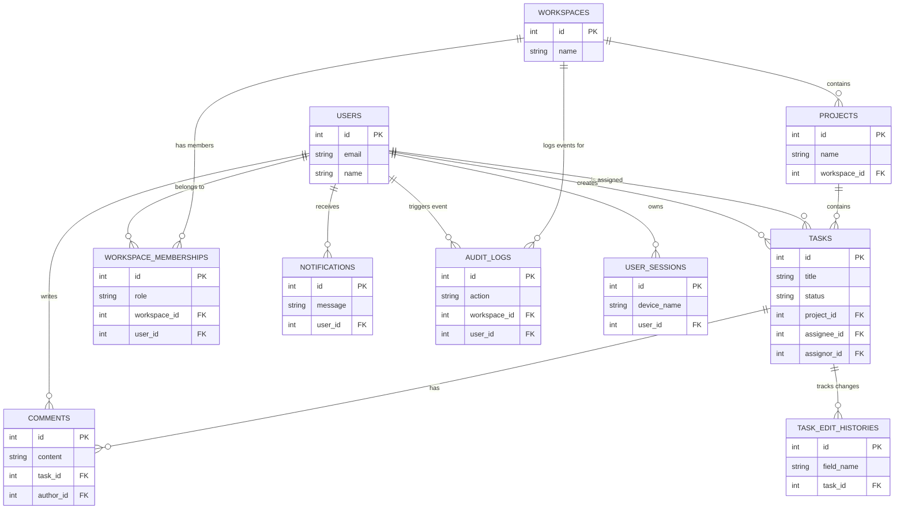

<div align="center">

# 🚀 Orbit Workspace

**A real-time, multi-tenant project management platform built for engineering teams.**

_The lightweight yet powerful blend of Trello, Asana, and Slack — built from scratch._


</div>

---

## 📖 Project Overview

Orbit Workspace is a multi-tenant, real-time project management platform that combines Kanban-style task boards, team collaboration, intelligent workload distribution, and workspace analytics into a single, polished application.

Users can create isolated **Workspaces**, invite members with granular role-based access (`Admin`, `Editor`, `Viewer`), organize work into **Projects**, and track tasks across a live **Kanban board** with real-time drag-and-drop synchronization powered by WebSockets.

> **Assignment Context:**  This platform was developed from scratch as a comprehensive engineering assignment given by **Navjot Kaur @ Softsensor.ai** (May 30, 2026). It demonstrates full-stack engineering capability — from database schema design through to Dockerized multi-service deployment.

---

## ✨ Key Features (Verified from Codebase)

### Authentication & Account Security
- **Email verification** via 6-digit OTP using the [Resend](https://resend.com) transactional email API (`services/email_service.py`)
- **Google OAuth 2.0** sign-in with automatic account provisioning (`routers/auth.py → /auth/google`)
- **Password complexity enforcement** — uppercase, digit, special character, 8+ chars — validated in Pydantic schemas (`models/schemas.py`)
- **Password reuse prevention** — checks against `UserProfileHistory` table to block reuse of current or previous passwords
- **Redis-backed brute-force lockout** — after 10 failed attempts in 10 minutes, the account is locked for 15 minutes (`routers/auth.py L253-L278`)
- **Device session management** — users can view all active sessions (device, IP, location via ip-api.com), and revoke individual sessions remotely (`/users/me/sessions`)
- **New device login alerts** — automated email notifications when a login occurs from an unrecognized device
- **Dual-storage JWT strategy** — `sessionStorage` for ephemeral login, upgradable to `localStorage` (30-day token) via the "Remember This Device" flow (`AuthContext.jsx`, `RememberMeDialog.jsx`)
- **Token revocation on logout** — JWTs are blocklisted in Redis with TTL matching the token's remaining lifetime (`routers/auth.py → /logout`)

### Account Deletion & GDPR-Style Lifecycle
- **30-day soft-delete schedule** — users request deletion via password or OTP verification; the account enters a grace period
- **Automatic task reassignment** on deletion — the `workload_balancer` algorithm redistributes the user's open tasks across remaining workspace members
- **Hard-delete cron** — `APScheduler` job runs every 24 hours to permanently purge accounts past the 30-day window (`main.py → hard_delete_expired_accounts`)
- **Deletion revocation** — users can cancel deletion simply by logging in during the grace period

### Workspaces & RBAC
- **Multi-tenant workspaces** with full CRUD and soft-delete
- **Three-tier RBAC** — `Admin`, `Editor`, `Viewer` — enforced server-side at every route
- **Invitation system** with email notifications, accept/reject flows, and re-invite for previously rejected users
- **Leave and delete request workflows** — members can request to leave; admins can request deletion (requires consensus from other admins)
- **Automatic task reassignment on member removal** — when a member leaves or is removed, their open tasks are redistributed using the Workload Balancer, with full audit trail

### Projects
- **CRUD with admin-only creation/deletion**
- **Project view tracking** — `UserProjectView` table records the last time each user viewed a project, powering "recently viewed" and unseen-change indicators on the frontend
- **Cascading notifications** — all workspace members are notified via in-app + email on project creation or deletion

### Tasks & Kanban Board
- **Task CRUD** with 5-level priority, due dates, and status tracking (`To Do`, `In Progress`, `Done`)
- **Granular edit permissions** — task creators and admins get full edit access; assignees can only change status. Done tasks are locked and require creator/admin override to unlock.
- **Task reassignment with reason** — when an assignee changes, both the old and new assignee are notified, and the reassignment reason is recorded
- **Full edit history** — every field change is recorded in `TaskEditHistory` with old/new values, editor, and timestamp
- **Search and filtering** — tasks can be filtered by keyword (title/description search), assignee, and status via query parameters
- **Pagination** — `skip`/`limit` parameters on task and project list endpoints

### Smart Algorithms (`services/algorithms.py`)

**1. Urgency Engine** — `calculate_urgency_score(priority_level, due_date) → float`
- Computes a dynamic score from 0–100 based on priority tier (`High`=70 base, `Medium`=40, `Low`=10) and time remaining until deadline
- Escalation tiers: <24h remaining adds up to 36 bonus points; <72h adds up to 14; past-due caps at base+50
- *Time Complexity: O(1), Space Complexity: O(1)*

**2. Workload Balancer** — `workload_balancer(users_workloads) → user_id`
- Sums the urgency score of every active task per user, then selects the user with the lowest cumulative workload
- Tie-breaker: adds `0.1 × task_count` to prefer fewer total tasks when urgency scores are equal
- Used in: auto-assign endpoint (`/projects/{id}/tasks/auto-assign`), member removal reassignment, and account deletion reassignment
- *Time Complexity: O(N × T) where N=users, T=avg tasks/user. Space Complexity: O(1)*

### Real-Time WebSockets
- **Personal notification channel** (`/ws`) — delivers `workspace_updated`, `task_created`, `task_updated`, `invitation_received`, `member_removed`, and other events to each user
- **Project board channel** (`/ws/projects/{project_id}`) — syncs `drag_start` and `drag_end` events across all connected clients, enabling collaborative drag-and-drop with live "someone is moving this" indicators
- **Dead connection cleanup** — `ConnectionManager` automatically prunes failed sockets on send failure
- **User departure broadcast** — when a user disconnects from a project channel, a `user_left` event releases their drag locks on all other clients

### Analytics
- **Workspace analytics endpoint** (`/workspaces/{id}/analytics`) — returns total tasks, status distribution, overdue count, and a "bottleneck" report (top 5 users with the most overdue tasks)

### Audit Logging
- **Full audit trail** via `AuditLog` table — records workspace/project creation, member joins/leaves/removals, task CRUD, reassignments, and admin overrides
- **Workspace-scoped audit log endpoint** (`/workspaces/{id}/audit-logs`)
- **Global user audit feed** (`/audit-logs`) — aggregates logs across all of a user's workspaces

### Notifications & Email
- **In-app notification system** — stored in `Notification` table with workspace context, read/unread state, and auto-resolution on action (e.g., notifications about a workspace are marked read when the workspace is deleted)
- **Transactional email via Resend API** — used for: verification, password reset, new device alerts, workspace invitations, member removals, project deletions, account deletion scheduling
- **Graceful fallback** — if `RESEND_API_KEY` is a dummy value, emails are logged to console instead of dispatched (local dev mode)

### Cron Jobs (`APScheduler`)
- **Deadline reminder** — runs hourly, finds tasks due within 24 hours, generates reminder notifications for assignees (deduplicates within 24h window)
- **Account hard-delete** — runs daily, permanently removes accounts 30+ days past their scheduled deletion date

### Frontend Architecture
- **React 19** with Vite 8 build tooling
- **Tailwind CSS v4** for utility-first styling
- **Framer Motion** for landing page animations
- **React Router v7** with nested layouts and `ProtectedRoute` wrapper
- **Context-based state management** — `AuthContext` (auth, sessions, remember-device) + `WorkspaceContext` (workspaces, projects, tasks, invitations, members)
- **Custom toast notification system** — `showToast()` dispatches a `CustomEvent` on `window`; `ToastContainer` component listens globally and renders stacked notifications with auto-dismiss
- **ErrorBoundary** — catches React runtime crashes, renders a recovery UI, and reports the error to the backend via `POST /client-errors`
- **Custom `useProjectWebSocket` hook** — manages the per-project WebSocket lifecycle for collaborative drag-and-drop
- **API utility layer** (`utils/api.js`) — centralized fetch wrapper with automatic JWT injection, error parsing, and global toast dispatch on failure

### Security Defenses
| Vulnerability | Mitigation |
|:---|:---|
| **SQL Injection** | All queries use SQLAlchemy ORM with parameterized bindings — no raw SQL anywhere in the codebase |
| **XSS (Cross-Site Scripting)** | Pydantic `@field_validator` on every user-facing text field rejects any input containing HTML tags (`<[^>]*>`); React's JSX escaping provides a second defense layer |
| **Broken Access Control** | Every route performs server-side RBAC checks against `WorkspaceMembership`; IDOR protection on `/users/{user_id}/workspaces` ensures users can only query their own data |
| **Brute Force** | Redis-backed `slowapi` rate limiting (5 req/min on login, register, forgot-password); account lockout after 10 failed attempts |
| **Token Theft** | JWT blocklist in Redis on logout; session validation against `UserSession` table on every authenticated request; tokens include a unique `jti` claim |
| **Password Reuse** | Historical password hashes stored in `UserProfileHistory`; bcrypt comparison blocks reuse of any previous password |

---

## 🛠️ Tech Stack

### Frontend
| Technology | Version | Purpose |
|:---|:---|:---|
| React | 19.2 | Component library |
| Vite | 8.0 | Build tool with HMR |
| Tailwind CSS | 4.3 | Utility-first styling |
| Framer Motion | 12.42 | Layout animations (landing page) |
| React Router | 7.18 | Client-side routing with nested layouts |
| Lucide React | 1.21 | Icon library |

### Backend
| Technology | Version | Purpose |
|:---|:---|:---|
| FastAPI | 0.137 | Async REST framework |
| SQLAlchemy | 2.0 | ORM with mapped column typing |
| Alembic | 1.18 | Schema migration version control |
| Pydantic | 2.13 | Request/response validation |
| PyJWT | 2.13 | JWT token creation and verification |
| bcrypt | 5.0 | Password hashing |
| Redis (via `redis-py`) | 8.0 | Token blocklist, rate limiting, pending registration store |
| slowapi | 0.1 | Redis-backed rate limiter middleware |
| APScheduler | 3.11 | Background cron jobs (deadline reminders, hard-deletes) |
| httpx | 0.28 | Async HTTP client (Google OAuth, IP geolocation, Resend API) |

### Infrastructure
| Component | Image / Tool | Purpose |
|:---|:---|:---|
| Database | `postgres:16-alpine` | Primary data store |
| Cache | `redis:alpine` | Rate limiting, token blocklist, pending registrations |
| DB Admin | `dpage/pgadmin4` | Visual database management |
| Frontend | `nginx:alpine` (multi-stage build from `node:20-alpine`) | Serves SPA + reverse proxy to backend |
| Backend | `python:3.11-slim` | FastAPI + Uvicorn |
| CI/CD | GitHub Actions | Black formatting, Flake8 linting, Pytest with 80%+ coverage gate |

---

## 🔌 API Reference

The backend exposes a fully typed REST API. Interactive Swagger documentation is auto-generated at `/docs` when the server is running.

### Authentication & Users

| Method | Endpoint | Auth | Rate Limited | Description |
|:---|:---|:---|:---|:---|
| `POST` | `/users/` | ❌ | 5/min | Register a new user (sends OTP email) |
| `POST` | `/verify-email` | ❌ | — | Verify email with 6-digit OTP |
| `POST` | `/login` | ❌ | 5/min | Authenticate and receive JWT |
| `POST` | `/logout` | ✅ | — | Revoke current token (Redis blocklist) |
| `POST` | `/auth/google` | ❌ | — | Google OAuth 2.0 login/register |
| `POST` | `/auth/remember-device` | ✅ | — | Upgrade session to 30-day persistent token |
| `GET` | `/users/me` | ✅ | — | Get current user profile |
| `PUT` | `/users/me` | ✅ | — | Update name or password (with current password verification) |
| `GET` | `/users/me/sessions` | ✅ | — | List all active/inactive device sessions |
| `POST` | `/users/me/sessions/{id}/revoke` | ✅ | — | Remotely revoke a specific session |
| `POST` | `/forgot-password` | ❌ | 5/min | Send password reset OTP |
| `POST` | `/verify-reset-otp` | ❌ | 5/min | Verify reset OTP validity |
| `POST` | `/reset-password` | ❌ | — | Reset password using verified OTP |
| `POST` | `/deletion-otp` | ✅ | — | Request account deletion authorization OTP |
| `POST` | `/schedule-deletion` | ✅ | — | Schedule account for 30-day deletion |
| `POST` | `/revoke-deletion` | ✅ | — | Cancel pending account deletion |

### Workspaces

| Method | Endpoint | Auth | Description |
|:---|:---|:---|:---|
| `POST` | `/workspaces/` | ✅ | Create workspace (creator becomes admin) |
| `GET` | `/users/{user_id}/workspaces` | ✅ | List user's workspaces (IDOR-protected) |
| `PUT` | `/workspaces/{id}` | ✅ Admin | Update workspace name/description |
| `DELETE` | `/workspaces/{id}` | ✅ Admin | Soft-delete workspace |
| `POST` | `/workspaces/{id}/members` | ✅ Admin | Invite user by email (with role) |
| `PUT` | `/workspaces/{id}/members/{user_id}` | ✅ Admin | Change member role |
| `DELETE` | `/workspaces/{id}/members/{user_id}` | ✅ Admin/Self | Remove member (triggers task reassignment) |
| `GET` | `/workspace-invitations` | ✅ | List pending invitations for current user |
| `POST` | `/workspace-invitations/{id}/accept` | ✅ | Accept invitation |
| `POST` | `/workspace-invitations/{id}/reject` | ✅ | Reject invitation |
| `POST` | `/workspaces/{id}/leave-requests` | ✅ | Submit leave request to admins |
| `POST` | `/workspaces/{id}/delete-requests` | ✅ Admin | Request workspace deletion (consensus) |
| `GET` | `/workspaces/{id}/audit-logs` | ✅ | Get workspace activity audit trail |

### Projects

| Method | Endpoint | Auth | Description |
|:---|:---|:---|:---|
| `POST` | `/projects/` | ✅ Admin | Create project in a workspace |
| `GET` | `/workspaces/{id}/projects` | ✅ | List workspace projects (paginated) |
| `PUT` | `/projects/{id}` | ✅ Admin | Update project name/description |
| `DELETE` | `/projects/{id}` | ✅ Admin | Soft-delete project |
| `POST` | `/projects/{id}/view` | ✅ | Record user's last view timestamp |
| `GET` | `/user/project-views` | ✅ | Get all project view timestamps for current user |

### Tasks

| Method | Endpoint | Auth | Description |
|:---|:---|:---|:---|
| `POST` | `/projects/{id}/tasks` | ✅ Editor+ | Create task with optional assignment |
| `POST` | `/projects/{id}/tasks/auto-assign` | ✅ Editor+ | Create task and auto-assign via Workload Balancer |
| `GET` | `/projects/{id}/tasks` | ✅ | List tasks (filterable by keyword, assignee, status; paginated) |
| `GET` | `/tasks/{id}` | ✅ | Get single task with full edit history |
| `PUT` | `/tasks/{id}` | ✅ | Update task fields (permission-gated per field) |
| `DELETE` | `/tasks/{id}` | ✅ Editor+ | Soft-delete task |
| `GET` | `/users/me/all-tasks` | ✅ | Aggregate all tasks across all user's workspaces |

### Comments

| Method | Endpoint | Auth | Description |
|:---|:---|:---|:---|
| `POST` | `/tasks/{id}/comments` | ✅ | Add comment to task (notifies assignee) |
| `GET` | `/tasks/{id}/comments` | ✅ | List all comments on a task |

### Notifications

| Method | Endpoint | Auth | Description |
|:---|:---|:---|:---|
| `GET` | `/notifications` | ✅ | List user notifications (paginated, newest first) |
| `PUT` | `/notifications/{id}/read` | ✅ | Mark notification as read |

### Analytics & Audit

| Method | Endpoint | Auth | Description |
|:---|:---|:---|:---|
| `GET` | `/workspaces/{id}/analytics` | ✅ | Task counts by status, overdue count, bottleneck report |
| `GET` | `/audit-logs` | ✅ | User's cross-workspace audit log feed |
| `POST` | `/client-errors` | ✅ (10/min) | Frontend error reporting endpoint |

### WebSocket Channels

| Endpoint | Description |
|:---|:---|
| `ws /ws?token=<jwt>` | Personal notification channel — receives real-time events (task CRUD, invitations, workspace changes) |
| `ws /ws/projects/{id}?token=<jwt>` | Project board channel — syncs drag-and-drop events (`drag_start`, `drag_end`, `user_left`) across clients |

---

## 🗂️ Database Schema

The application uses **13 tables** managed via Alembic migrations:

| Table | Purpose |
|:---|:---|
| `users` | User accounts with email verification, password history, deletion scheduling |
| `workspaces` | Multi-tenant organizational units |
| `workspace_memberships` | RBAC junction table (admin/editor/viewer roles, invite status) |
| `projects` | Boards within workspaces |
| `tasks` | Kanban cards with priority, status, assignee, assignor, soft-delete |
| `comments` | Task-level discussion threads |
| `notifications` | In-app notification queue with workspace/membership context |
| `audit_logs` | Immutable activity trail (workspace/project scoped) |
| `user_sessions` | Device sessions with JTI, IP, location, active/revoked state |
| `task_edit_histories` | Per-field change tracking for task mutations |
| `user_project_views` | Last-viewed timestamps per user per project |
| `user_profile_histories` | Historical name/password changes for reuse prevention |

### Entity-Relationship Diagram

To make the architecture easier to digest, here is a simplified ER diagram mapping the core business logic and relational flows, omitting auxiliary fields like timestamps and internal flags for clarity.



---

## 🚀 Local Setup

### Prerequisites
- Docker & Docker Compose

### 1. Clone and configure

```bash
git clone https://github.com/chhayanshporwal/orbit-workspace.git
cd orbit-workspace
```

Create a `.env` file in the root directory:

```env
POSTGRES_PASSWORD=your_db_password
PGADMIN_DEFAULT_PASSWORD=your_pgadmin_password
SECRET_KEY=your_64_char_hex_secret
REDIS_PASSWORD=your_redis_password
GOOGLE_CLIENT_ID=your_google_oauth_client_id
GOOGLE_CLIENT_SECRET=your_google_oauth_secret
RESEND_API_KEY=your_resend_api_key
```

### 2. Start the cluster

```bash
# Development (with hot-reload and pgAdmin)
docker compose up -d --build

# Production (no pgAdmin, exposes port 80/443)
docker compose -f docker-compose.prod.yml up -d --build
```

### 3. Access the services

| Service | URL |
|:---|:---|
| Frontend (Nginx) | [http://localhost:3000](http://localhost:3000) |
| Backend Swagger Docs | [http://localhost:8000/docs](http://localhost:8000/docs) |
| pgAdmin | [http://localhost:5050](http://localhost:5050) |

### 4. Run backend tests

```bash
docker exec -it orbit_backend pytest --cov=. --cov-fail-under=80
```

### 5. Shut down

```bash
docker compose down
```

---

## 🧪 CI/CD Pipeline

The project includes a **GitHub Actions** workflow (`.github/workflows/ci.yml`) that runs on every push and PR to `main`:

1. **Black** — enforces consistent Python formatting
2. **Flake8** — static analysis and linting
3. **Pytest** — runs the full test suite with **80% minimum code coverage** gate
4. **Codecov** — uploads coverage reports for tracking

---

## 🗺️ Future Roadmap

| Phase | Focus | Description |
|:---|:---|:---|
| **Phase 1** | Observability & Monitoring | Integrate Sentry across backend and frontend for error tracking and API performance tracing |
| **Phase 2** | Background Processing | Offload email dispatch and analytics aggregations to Celery workers backed by Redis |
| **Phase 3** | State Management | Migrate from React Context to Redux Toolkit for optimized re-render performance on large Kanban boards |
| **Phase 4** | Frontend Testing Suite | Implement Playwright E2E tests covering authentication flows, Kanban interactions, and cross-browser UI stability |
| **Phase 5** | Mobile & Media Expansion | Refine responsive UI components, support secure file attachments on tasks, and develop a native mobile application sharing the same backend |

---

<div align="center">

**Engineered by [Chhayansh Porwal](https://chhayanshporwal.github.io/)**

</div>
